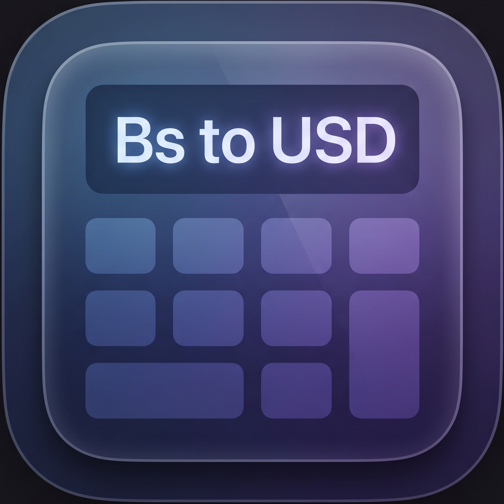

<p align="center">
  
</p>

<h1 align="center">⚡ Arby — Calculadora de Arbitraje Cambiario & Compra Bancaria</h1>

<p align="center">
  <strong>Una herramienta web progresiva (PWA) de alto rendimiento para arbitraje cambiario, compra de divisas en banca nacional y conversión financiera en tiempo real diseñada específicamente para el mercado de Venezuela.</strong>
</p>

<p align="center">
  
  
  
  
  
  
</p>

<p align="center">
  <a href="#-qu%C3%A9-de-va-el-proyecto">¿De qué va el proyecto?</a> •
  <a href="#-puntos-fuertes-y-caracter%C3%ADsticas-principales">Características</a> •
  <a href="#-integraci%C3%B3n-de-datos-apis-utilizadas">APIs</a> •
  <a href="#-tecnolog%C3%ADas-utilizadas">Tecnologías</a> •
  <a href="#-instalaci%C3%B3n-y-uso-local">Instalación</a> •
  <a href="https://github.com/carlettocoding/calculadora-arbitraje">GitHub</a>
</p>

---

## 🚀 ¿De qué va el proyecto?

En mercados dinámicos como el venezolano, calcular márgenes de ganancia exactos, comisiones bancarias y variaciones de tasas de cambio puede volverse una tarea compleja y propensa a errores manuales. 

**Arby** centraliza estas operaciones en una interfaz limpia, responsiva e intuitiva. Permite a los usuarios:
1. **Arbitraje Simple (Compra en Banco):** Pestaña ubicada a la izquierda para saber exactamente cuántos Bolívares se requieren para comprar divisas en dólares (USD) en la banca nacional, calculando comisión de intervención cambiaria, tasa real efectiva y botón de copiado bancario directo.
2. **Calcular Arbitraje Cambiario (Pro):** Situada en el centro para evaluar de forma rápida los márgenes netos de ganancia al comprar y vender activos en diferentes plataformas (incluyendo flujos tradicionales Bs ⇄ Bs y flujos cripto USDT ⇄ USDT), calculando comisiones operativas y de red automáticamente.
3. **Calculadora Inversa:** Estimar con exactitud el capital inicial necesario para lograr una meta de ganancias específica en dólares (USD).
4. **Conversor del Día a Día con Historial Fidedigno:** Convertidor multipropósito con calculadora matemática integrada (+, −, ×, ÷), copiado bancario estricto a 2 decimales, botón «↩️ Cargar» en historial y registro con cotizaciones congeladas del día.
5. **Detección de Tasa Emitida (Próximo Día / Lunes):** Integración con DolarVzla API para anticipar la tasa que regirá mañana con sincronización instantánea y spreads duales en vivo (auditable con `?test_tasa_nueva=true`).
6. **Botón de Refrescar Flotante en Móviles:** Botón FAB circular fijo abajo a la derecha ergonómico para uso con una sola mano.
7. **Disponibilidad Offline Blindada:** Hoja de estilos autónoma local `styles.css` y Service Worker `arby-v24` que garantizan funcionamiento total sin internet.
8. **Onboarding Tutorial Integrado:** Tour interactivo guiado paso a paso con spotlights para facilitar el aprendizaje de usuarios nuevos.

---

## 🔥 Puntos Fuertes y Características Principales

* **⚡ Enfoque en la Experiencia de Usuario (UX/UI):** Diseñada usando Tailwind CSS y estilos locales compilados, cuenta con estética oscura premium, FAB flotante en smartphones, controles táctiles optimizados con barra de calculadora matemática, alertas dinámicas (toasts) y prevención de errores de entrada de datos.
* **🔋 Arquitectura PWA (Progressive Web App):** 
  * Soporte completo para instalación en pantallas de inicio mediante un archivo `manifest.json` y modal instructivo dinámico para Safari (iOS) y Chrome (Android).
  * Estrategia *Network-First* para tasas y navegación implementada mediante un **Service Worker (`sw.js`)** dedicado (`arby-v24`), respaldado con `styles.css` local y modo de prueba (`?test_offline=true`).
* **🪙 Binance P2P Directo vía CriptoYa:** Consulta fidedigna y libre de fallbacks inexactos para tasas USDT/VES en tiempo real.
* **🏦 Copiado Bancario Estricto a 2 Decimales:** Botones de un toque que normalizan montos sin separadores de miles y con coma decimal exacta (ej. `162938,16`), evitando errores de decimales en Pago Móvil / apps bancarias.
* **🔒 Modo Incógnito / Privacidad:** Integra la funcionalidad de desenfoque (`privacy-blur`) en los campos de montos numéricos para ocultar información financiera sensible del cursor en entornos públicos.
* **📸 Captura de Pantalla Integrada:** Integración con `html2canvas` para exportar de manera limpia los resultados de tus cálculos o capturas de pantallas de los márgenes directamente como imagen para compartir en grupos de trabajo.
* **🛠️ Construido con Vibecoding:** Este desarrollo representa el poder del *Vibecoding*, donde la visión estratégica del flujo del negocio se une a la velocidad de iteración de la IA para construir un software listo para producción en tiempo récord, libre de dependencias pesadas innecesarias.

---

## 🔌 Integración de Datos (APIs Utilizadas)

Para ofrecer un servicio confiable y automatizado sin necesidad de bases de datos externas de backend, la aplicación se conecta directamente de forma asíncrona client-side a fuentes de datos financieras confiables:

* **Tasas Oficiales y Emitidas (DolarVzla API + DolarAPI):**
  * DolarVzla: `https://rates.dolarvzla.com/bcv/current.json` (vigente y emitida de mañana)
  * DolarAPI Fallback: `https://ve.dolarapi.com/v1/dolares/oficial` y `https://ve.dolarapi.com/v1/euros/oficial`
* **Tasa de Criptomonedas P2P (USDT / VES):**
  * Consulta en vivo del promedio oficial del mercado P2P de Binance a través de **CriptoYa** (`https://criptoya.com/api/binancep2p/USDT/VES/1`) con caché local resiliente.
* **Módulo de Históricos:** 
  * Gráficos SVG interactivos en el conversor que consumen series de tiempo a través de endpoints de históricos de DolarAPI para graficar tendencias en lapsos de 10 días, 1 mes, 3 meses, 6 meses y 1 año.

---

## 🛠️ Tecnologías Utilizadas

* **HTML5** & **JavaScript (ES6+)** - Lógica pura y manipulación del DOM nativa sin frameworks pesados.
* **Tailwind CSS** - Estilizado moderno, responsivo y dinámico mediante CDN.
* **Service Workers** - Cacheo de activos y soporte PWA independiente.
* **html2canvas** - Generación y exportación de capturas de pantalla de resultados desde el cliente.

---

## 📥 Instalación y Uso Local

Al ser un desarrollo completamente estático del lado del cliente, puedes iniciar un servidor de desarrollo de forma muy simple mediante Node.js:

1. Clona el repositorio:
   ```bash
   git clone https://github.com/TU_USUARIO/arby.git
   ```
2. Instala las dependencias necesarias:
   ```bash
   npm install
   ```
3. Ejecuta el servidor local:
   ```bash
   node server.js
   ```
4. Abre [http://localhost:3000](http://localhost:3000) en tu navegador.
